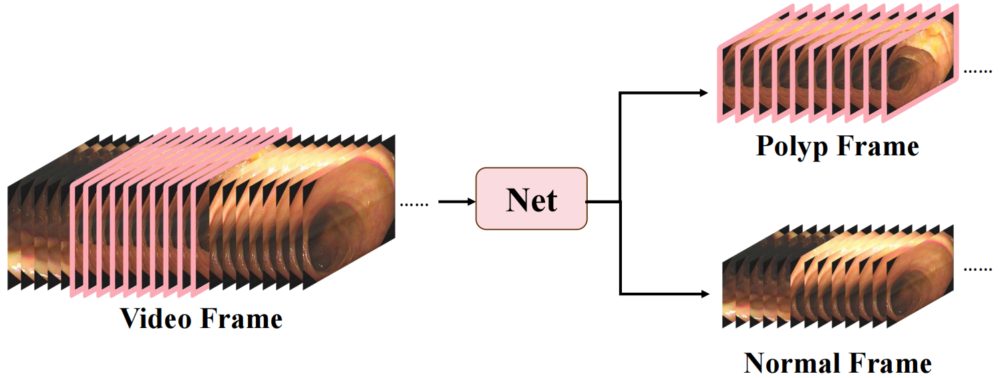
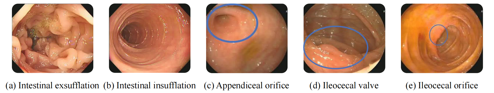
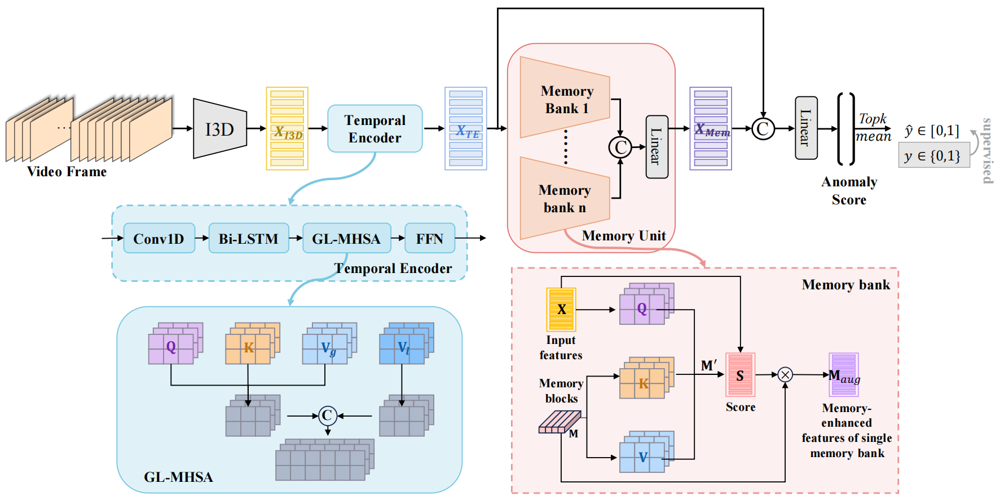

# TEMory
TEMory, a model featuring a Temporal Encoder and Memory Unit, designed for weakly supervised colonic polyp frame detection with a comprehensive understanding of normal frame characteristics.
> [**CCSCW'24**] [**TEmory: A Temporal-Memory Approach to Weakly Supervised Colonic Polyp Frame Detection**](https://link.springer.com/chapter/10.1007/978-981-96-2373-0_27)
>
> *Preprint is available: [TEMory_preprint](https://github.com/Liu-Yufei/TEMory/blob/main/assets/TEmory__A_Temporal_Memory_Approach_to_Weakly_Supervised_Colonic_Polyp_Frame_Detection.pdf)*
>
## Task
Following existing works, we this formulate weakly supervised colonic polyp frame detection task as an anomaly detection task.



## Challenge
Both exsufflation state and specialized structures make the assessment of adjacent frames particularly important.



Improving polyp detection in colonoscopy videos requires two key strategies: exploiting the inter-frame relationships and temporal characteristics to facilitate the robust extraction of information and intensifying the focus on learning paradigms that pertain to the understanding of normal structures.

## Overview
Drawing from the analysis, we propose TEmory, a novel weakly supervised polyp frame detection model. Specifically, the Temporal Encoder is designed based on Bidirectional Long Short Time Memory (Bi-LSTM) and Global and Local Multi-Head Self-Attention (GL-MHSA), exploiting temporal information and augmenting the descriptive power of embeddings, enabling the precise capture of information and delineation of associations between adjacent frames. 

Additionally, the Memory Unit, constituted by multiple parallel self-attention memory banks, not only elevates the dimensionality of the input feature space but also comprehensively stores a variety of features pertaining to specialized structures, thereby enhancing the capability for feature retrieval.




## Dataset

[I3D features of the dataset](https://drive.google.com/file/d/1-2tYeNybZx2Trrj-76MThq__Tf71eKD3/view?usp=sharing) 
>
[Original colonoscopy videos](https://drive.google.com/file/d/1PTQdluckHm7aeVzgRHuoTTpz-Sum7xmF/view?usp=sharing).

## Citation
If you find our work useful, please cite:
```bibtex
@inproceedings{liu2024temory,
  title={TEmory: A Temporal-Memory Approach to Weakly Supervised Colonic Polyp Frame Detection},
  author={Liu, Yufei and Gao, Jianzhe and Luo, Zhiming and Li, Shaozi},
  booktitle={CCF Conference on Computer Supported Cooperative Work and Social Computing},
  pages={390--401},
  year={2024},
  organization={Springer}
}
```
If you use the dataset, please also consider citing the papers below:
```bibtex
@inproceedings{ma2021ldpolypvideo,
  title={Ldpolypvideo benchmark: A large-scale colonoscopy video dataset of diverse polyps},
  author={Ma, Yiting and Chen, Xuejin and Cheng, Kai and Li, Yang and Sun, Bin},
  booktitle={International Conference on Medical Image Computing and Computer-Assisted Intervention},
  pages={387--396},
  year={2021},
  organization={Springer}
}
```
```bibtex
@article{borgli2020hyperkvasir,
  title={HyperKvasir, a comprehensive multi-class image and video dataset for gastrointestinal endoscopy},
  author={Borgli, Hanna and Thambawita, Vajira and Smedsrud, Pia H and Hicks, Steven and Jha, Debesh and Eskeland, Sigrun L and Randel, Kristin Ranheim and Pogorelov, Konstantin and Lux, Mathias and Nguyen, Duc Tien Dang and others},
  journal={Scientific data},
  volume={7},
  number={1},
  pages={1--14},
  year={2020},
  publisher={Nature Publishing Group}
}
```
---
